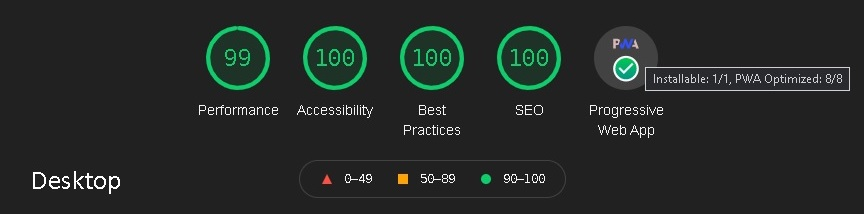

<h1 align="center">My portfolio website with React</h1>

# Table of Contents

- [Overview](#overview)
- [Tech](#tech)
- [What have I learned?](#what-i-have-learned)
- [Knowing issues](#knowing-issues)

# Overview

<p align="center"></p>

# Tech

- React
  - Hooks
  - Context Provider - global state
  - Theme Provider
- Styled Components
- Google Recaptcha v2
- Google Analytics
- Cloudflare
- Eslint
- Prettier

# What I have learned?

<details>
<summary style="font-weight:bold">My component for properly sizing images </summary>
<p>

Example of use my image component:
[example](src/pages/Projects/Now/Now.js)

Just set width in % and meta.json and watch the magic!

- image has a correct placeholder - no content reflow
- after mount, correct image size was downloaded
- support for legacy browsers - alt format

- [Image component](src/components/Image/Image.js)
</p>
</details>

<details>
<summary style="font-weight:bold">Serve modern code to modern browsers</summary>

<p>

Ship old legacy code, only to old browsers.

> detect them, by checking is 'nomodule' in script

I build app with creact-react-app and i don't want to eject. So I analyze build process and found working solution.
It's ok for app hosted on file hosting. It cannot by use for app deployed by connecting to repository like Netlify.

### Build for legacy browsers:

1. Uncomment in `index.js` lines with **//legacy**.
2. In `package.js` change browserlist to:
   `"production": [ "> 1%", "last 2 versions", "Firefox ESR" ],`
3. Delete `build` folder and `node_modules/.cache`
4. Build.
5. Copy builded folder to new folder `App/legacyApp`.

### Build for modern browsers:

1. Comment in `index.js` lines with **//legacy**.
2. In `package.js` change browserlist to:
   `"production": [ "Chrome >= 60", "Safari >= 10.1", "iOS >= 10.3", "Firefox >= 54", "Edge >= 15" ],`
3. Delete `build` folder and `node_modules/.cache`
4. Build.
5. Copy builded folder to new folder `App/modernApp`.

### Combine both app without ejecting:

1. Add `/App/` to `.eslintignore`
2. Search(with match case) in `App/legacyApp/build` and replace all:
   `static/` to `legacy/`
   `service-worker` to `legacy-worker`

   Rename `static` folder to `legacy` and `service-worker` to `legacy-worker` (both js and map.js)

3. Repeat point "2" for `modern` app.

4. Look at `index.template.html` in `readme` directory , you need to create similar file:

   1. Go to `legacyApp/index.html` - all changes go here.
   2. Paste this code at first line of script:

      ```
      var modernToLoad = ["/modern/js/2.03ef0271.chunk.js", "/modern/js/main.fc69b70a.chunk.js"];
      var legacyToLoad = ["/legacy/js/2.37a35dcb.chunk.js", "/legacy/js/main.fd3b7002.chunk.js"];

      var s = document.createElement('script');
      var isModern = 'noModule' in s;
      var myPath = isModern ? 'modern/js/' : 'legacy/js/';
      var myScripts = isModern
         ? {
            3: '1d95ddd8',
            4: 'dc26f350',
            5: '965925f2',
            6: 'ce8acd4a',
            7: '2beed0d2',
            8: 'a06220aa',
            9: '77be6416',
            10: 'dd6cfbd2',
            11: 'ffd4f2b4',
            12: '01b81a6a',
            }
         : {
            3: '92e8b11b',
            4: '52489dcd',
            5: '8ac16a87',
            6: 'cd1196c3',
            7: 'df364481',
            8: '6ca13b4b',
            9: 'b7e39262',
            10: '87ee5843',
            11: '81504600',
            12: '047dc5d9',
            };

      function $loadjs(modernSrc, legacySrc) {
         var myScriptsToLoad = isModern ? modernSrc : legacySrc;
         for (var counter = 0; counter < myScriptsToLoad.length; counter++) {
            s = document.createElement('script');
            s.src = myScriptsToLoad[counter];
            document.head.appendChild(s);
         }
      }

      $loadjs(modernToLoad, legacyToLoad); // must be at the last line of whole script
      ```

   3. Replace `legacyToLoad` links with src from end of `legacyApp/index.html` **<scripts>** tags.
      Delete this tags from end.
   4. Replace `modernToLoad` links with src from end of `modernApp/index.html` **<scripts>** tags.
   5. Look at `myScripts` variable and find similar objects in `modernApp/index.html` and `legacyApp/index.html`.
      Copy it to our `myScripts` variable.
   6. Replace object found at 5. to `myScripts`.
   7. A few lines up replce `legacy/js/` with `myPath` object.
   8. Compare your file with mine `index.template.html`.

5. Cut `service.worker files` and `modern`(old "static") folder from `App/modernApp` and paste it to `App/legacyApp`.
6. Delete `App/modernApp` folder.
7. Minify `index.html` and all other edited files. For working legacy app you shuld use good minifier:

   Script minifier (cut code from **`<script>`**):
   [https://javascript-minifier.com/](https://javascript-minifier.com/)

   Html minifier:
   [https://www.willpeavy.com/tools/minifier/](https://www.willpeavy.com/tools/minifier/)

   Then combine code.

8. You can rename `legacyApp` to `build`, replace with orginal `build` folder and run localhost!

**Done!**

</p>
</details>

<details>
<summary style="font-weight:bold">How lock scroll, e.q. on mobile menu</summary>
<p>

It's simple. Checkout:
[MobileMenu.logic](src/components/MobileMenu/MobileMenu.logic.js)

</p>
</details>

<details>
<summary style="font-weight:bold">How to use intersection obesrver</summary>
<p>

and load dynamically pages

- [IntersectionLoader](src/components/IntersectionLoader/IntersectionLoader.js)
- [Mobile.logic](src/View/Mobile/Mobile.logic.js)

</p>
</details>

<details>
<summary style="font-weight:bold">Fullscreen mode issue</summary>
<p>

- it's not possible to set full screen page without user action

- [syntax problem](https://generatedcontent.org/post/70347573294/is-your-fullscreen-api-code-up-to-date-find-out-how-to)

- ios - not possible for all versions

- [solution](src/utils/fullScreen.js)

</p>
</details>

<details>

<summary style="font-weight:bold">How correctly set css breakpoints</summary>
<p>

[great article](https://www.freecodecamp.org/news/the-100-correct-way-to-do-css-breakpoints-88d6a5ba1862/)

</p>
</details>

- how support different type of input devices
  - detect touch
  - how avoid software acceleration on touchpad (user experience)
  - support keyboard - i learned a lot of shortcuts
- lazy loading is great for performance - but nesting can slow it down
- create and optimize css animations
- using chrome dev tools
- configure eslint + prettier
- update service worker
- how styling to support old browsers (and how avoid issues)
- styled components are cool but grid autoprefixer didnt work for them
- how avoid rerendering components
- how wrote clean code(simplify and splitting code)
- lighthouse is a great tool - i fixed all the problems and learn a lot
- why Mobile First is great approach
- creating backend for contact form
- why AWS and Google Lambda isn't for me
  - i cannot sleep without trigger preventing from ddos cost
- manifest / logo / favicon isn't obvious
  - [great tool](https://realfavicongenerator.net/)

# Knowing issues

<details>
<summary style="font-weight:bold">IE menu incorrect rendering</summary>
<p>couse no support for `preserve-3d`
</p>
</details>

<details>
<summary style="font-weight:bold">Firefox lag menu</summary>
<p>
This bug is hard to avoid in my case. The order of transformation is important and the know tricks didn't work.
</p>
</details>

<details>
<summary style="font-weight:bold">Small screen on desktop</summary>
<p>
Below 600 px height switching to mobile view. Maybe solution is to force scaling down and  proposing fullscreen mode to hide the problematic bar.
</p>
</details>
